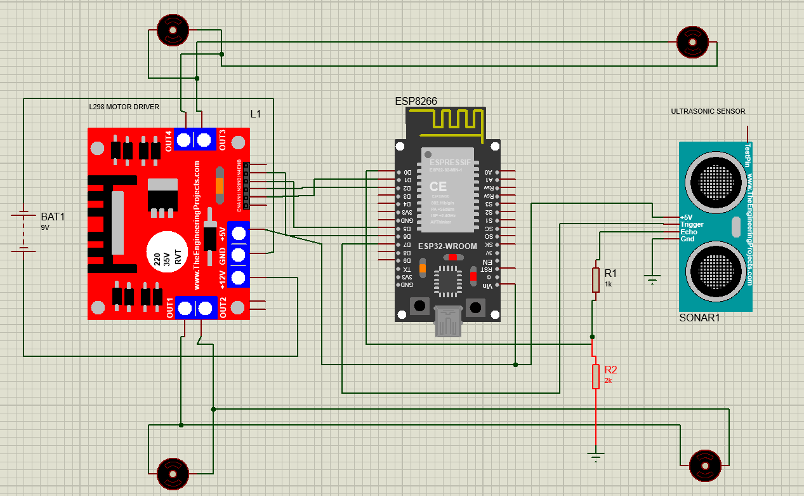
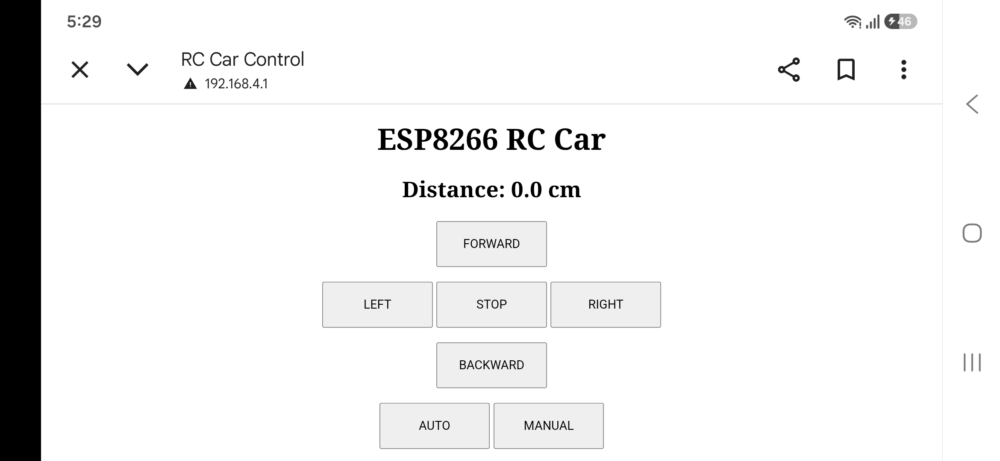
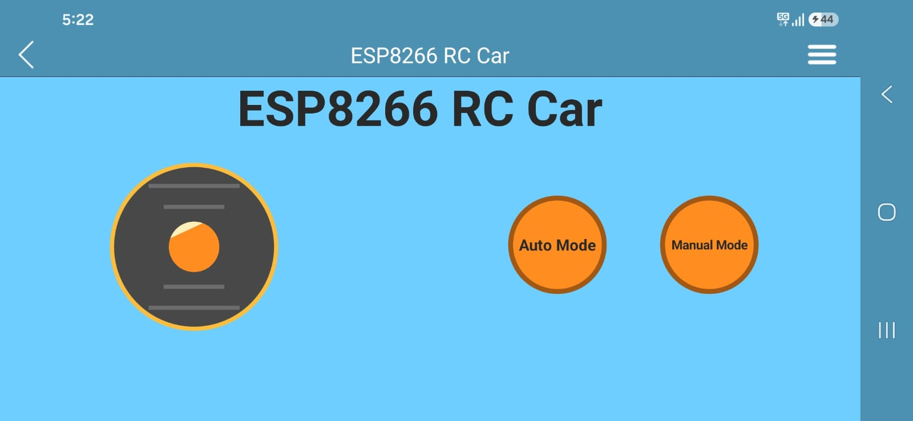

# ESP8266-Smart-RC-Car
ESP8266-based WiFi RC Car with dual control modes: Manual and Auto. Control the car through a web interface or RemoteXY mobile app. Features obstacle detection and avoidance using an HC-SR04 ultrasonic sensor, wireless communication, and motor control via an L298N driver, demonstrating IoT and embedded systems concepts.

# Features

✅ WiFi-based Web Control

✅ Mobile App Control using RemoteXY

✅ Manual Driving Mode

✅ Automatic Obstacle Avoidance Mode

✅ ESP8266 Access Point Control

✅ Ultrasonic Distance Measurement

# Components Used
| Component                 | Quantity |
| ------------------------- | -------- |
| ESP8266 NodeMCU           | 1        |
| L298N Motor Driver        | 1        |
| HC-SR04 Ultrasonic Sensor | 1        |
| DC Gear Motors            | 4        |
| Chassis                   | 1        |
| Battery Pack              | 1        |

# Pin Connections
| ESP8266 | L298N |
| ------- | ----- |
| D1      | IN1   |
| D2      | IN2   |
| D5      | IN3   |
| D6      | IN4   |

| ESP8266 | HC-SR04 |
| ------- | ------- |
| D7      | Trigger |
| D0      | Echo    |

# Circuit Diagram

# Working
**Manual Mode**

User controls the car through:

- Web Browser Interface
- RemoteXY Mobile App

**Auto Mode**

Car:

1. Moves forward
2. Detects obstacle
3. Turns right
4. If obstacle detected repeatedly
5. Turns left and searches for a free path

# Screenshots
**Web Interface**

***RemoteXY App***

- For RemoteXY version first watch below video
  
[Watch video](https://youtu.be/F3T0NSiQITM?si=ly5TRRQ8wjIt9gEx)

# Demo Video
- ESP8266 RC Car controll using Webpage Video
[▶️ Watch Demo Video](https://youtu.be/8wrvooP1H3w?si=Tw96OTQwvSqVlURx)

- ESP8266 RC Car controll using RemoteXY App Video
  Put your YouTube video link.

# Code

- Webpage control : Go above click Web_control > RC_car_using_webpage.ino
- App control : Go above click App_control_RemoteXY > RC_car_using_Mobile_App.ino
